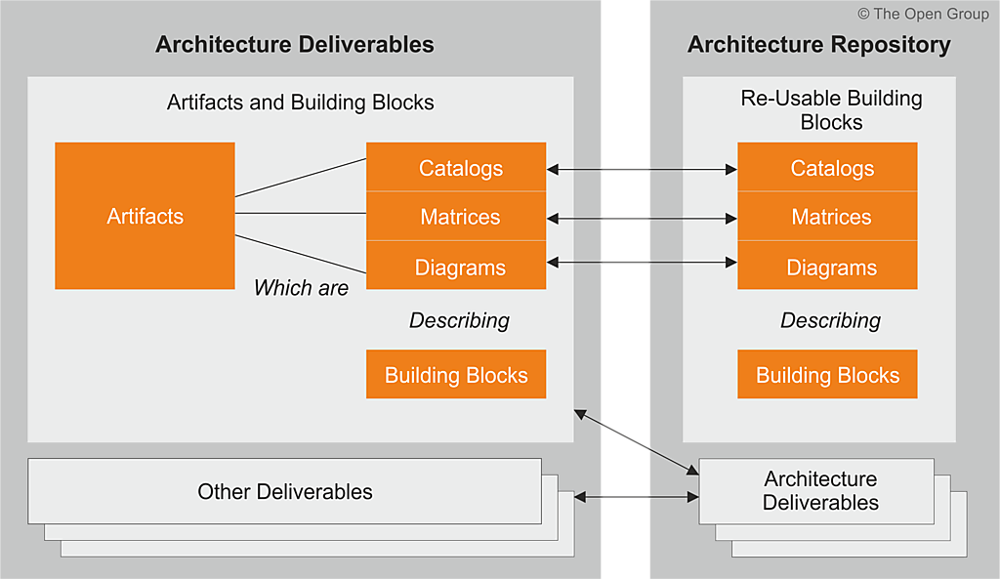

# La Problemática del Tiempo de Mercado (salidas a producción) en el FNA
Con base a los diagnósticos de población del portafolio de servicios SOA del FNA (ver @eservices1-22), el cual trata de la clasificación de servicios, tenemos el hecho de que la _mayor cantidad de servicios del portafolio son del tipo servicios de información_ (ver [Anexo 2. Población de servicios del portafolio FNA]). 

Lo anterior significa que la mayor cantidad de servicios SOA que son relevantes para el Fondo Nacional existen para únicamente para propósitos de transporte de información. Esto es, sirven para responder a solicitudes de información que los procesos o aplicaciones se hacen entre ellos. Esta característica de la población del portafolio de servicios se vuelva una situación desfavorable para los cambios de negocio que se ven afectados por el esfuerzo en mantenimiento y gobierno SOA que consumen aquellos otros servicios en detrimento de los servicios de negocio. 

    Los servicios de negocio, aquellos que elaboran una respuesta mediante un cómputo (sea cálculo, diferencia, comparación...), y por tanto, los que inciden en la flexibilidad de negocio, son los de menor presencia en el portafolio FNA.

El esfuerzo que toman los cambios en los servicios de transporte de información debe estar influyendo en inclinar los tiempos hacia el mantenimiento de servicios de información en lugar de a la velocidad de salida (tiempo de mercado) de las funcionalidades de negocio.

Esto último es lo que determina la problemática de la demora en el tiempo de mercado/salida a producción del FNA

# Propuesta de Flexibilidad y Mejora del Tiempo de Mercado del FNA
## Bloques Genéricos de Construcción de la Arquitectura de Referencia
Desde la arquitectura de referencia SOA 2.0 del FNA hacemos la propuesta de  mejoramiento de los tiempos de mercado del FNA son aquellos referidos en los pasos no. 2 y 5 del flujo de trabajo de la Oficina de Arquitectura y son en realidad paquetes de funcionalidad definidos por las necesidades de negocio o del arquitecto. Estos bloques pueden implementar a cualquier clasificador (objeto material) de los modelos del repositorio de arquitectura empresarial.

Ejemplo de estos bloques predefinidos en el repositorio de arquitectura pueden ser un proceso, un actor, un servicio, una aplicación, o una entidad de datos que haga parte del glosario de contenidos de la empresa Fondo Nacional. 

Los bloques genéricos deben cumplir algunas reglas, como que siempre deben  representar una necesidad concisa de negocio o de arquitectura, que representen un único concepto con límites claros, y que sera reconocible como 'parte' en un dominio de la arquitectura. Puede o no interoperar con otros bloques, en cuyo caso también habrá que definirlos. Es importante que un bloque de construcción tenga una implementación lógica en el repositorio, además de un uso, y que esté implementado y evolucione mediante la tecnología. 

Los bloques de solución pueden estar compuesto por otros, en cuyo caso serán un ensamblado; pueden ser descompuestos (desensamblado) en los bloques pequeños que los constituyen. 

Una regla necesaria a la hora de diseñar e implementar un bloque de construcción genérico, y obligatorio, que sea reutilizable, reemplazable, y especificado a conformidad.

Los sistemas y herramientas de software de la arquitectura del FNA deben estar creados a partir de colecciones de bloques de solución. De ahí que estos bloques deban tener una interfaz de interacción clara y estable para con otros bloques. 

Lo más importante de este concepto de bloques genérico es que sea incremental. Es decir, que sea creado mediante el de los niveles de detalle (100 al 500). Por ejemplo, a nivel 100, el arquitecto del FNA podría dar comienzo al modelado de un bloque de genérico mediante un nombre, una descripción o un esquema. Luego, el arquitecto de solución, puede descomponer este mismo bloque en múltiples construcciones acompañada de una especificación más detallada (nivel 200 al 500).

En la siguiente imagen ilustramos una representación de un bloque genérico y los elementos con los que se implementan en el repositorio de arquitectura del FNA.. 

{#fig:bb.png width=}

_Fuente: TOGAF 9.1._

 

## Bloques Genéricos de Construcción. Definición
Un bloque de construcción representa un componente (potencialmente reutilizable) de una única capacidad de la arquitectura de referencia del FNA, objeto de este proyecto. Puede ser ensamblado con otros bloques de construcción para agilizar la creación de arquitecturas y soluciones posteriores. 

Los bloques de construcción genéricos deben tener asociado una contraparte usable llamada _bloque de solución_. Un bloque de solución representan los componentes que se utilizarán para implementar a un bloque genérico. Por ejemplo, 

    "Una red es un bloque de construcción que puede describirse a través de artefactos complementarios y luego ponerse en uso para realizar soluciones para la empresa". Nota: basado en la definición de TOGAF 9.1.

 

